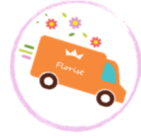
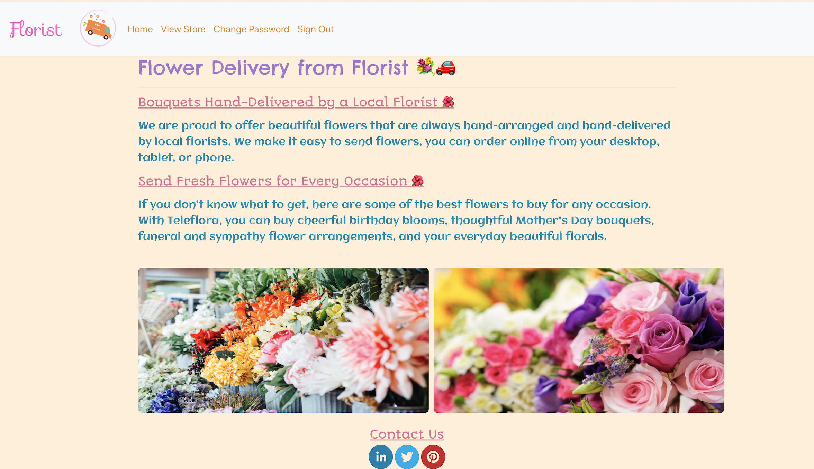
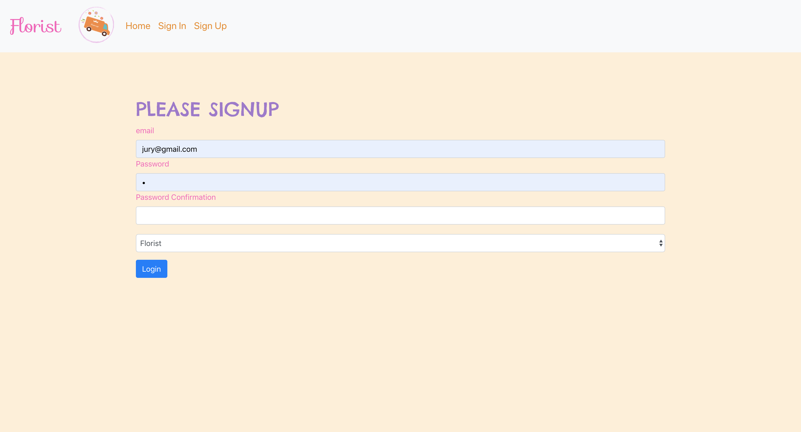
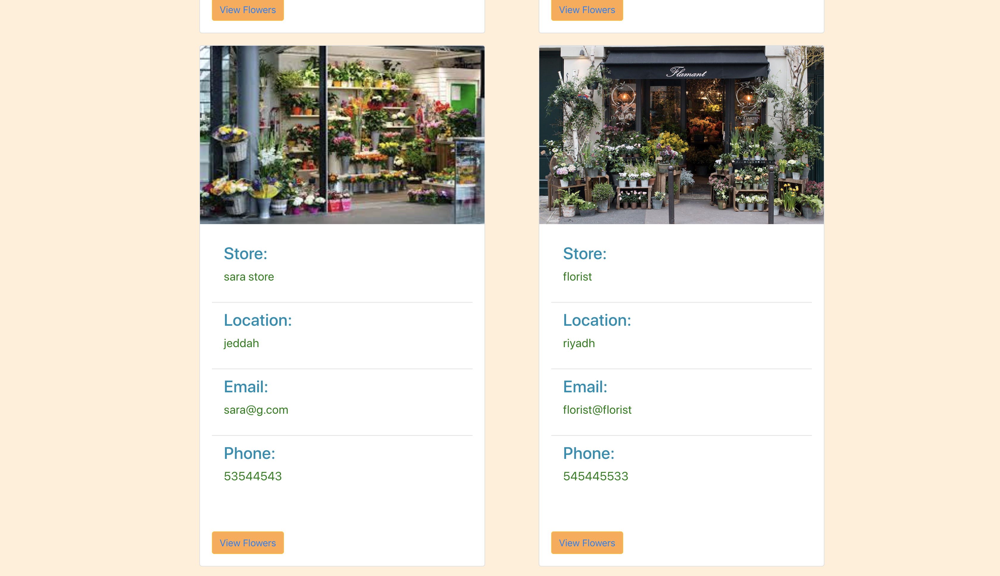
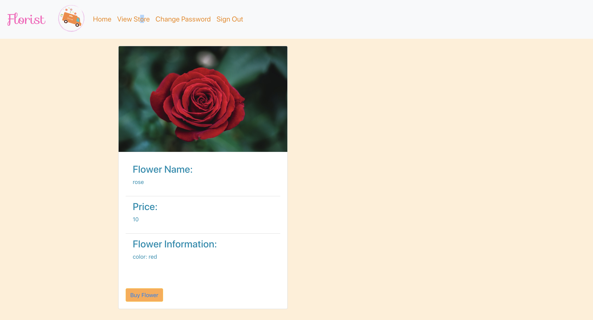

<!-- 

# express-api-template

A template for starting projects with `express` as an API. Includes
authentication and common middlewares.

# Installation

# Structure

# API

### Authentication

| Verb  | URI Pattern         |
| ----- | ------------------- |
| POST  | `/sign-up`          |
| POST  | `/sign-in`          |
| PATCH | `/change-password/` |

#### POST /sign-up -->
 
# Florist
 
Home Page 
#

Florist is a website that connect the florist with customerts to buy flowers from different flower stores. 
Once the user wants to create an account they must choose whether they are a customer or florist 
 
#

 
Here when the user wants to view flower stores.
 
When the user clicks on view flower buttons, it will view different types of flowers for that store.
#
there are two type of end users: 
1- florist: the owner can sign-up,log-in, add store and flower, edit, and delete it. 
2- customer: the customer can sign-up,log-in, view store and flower. 

#

Store data:

- store name
- location
- email 
- phone number
- image

Flower data:

- flower name
- price
- information 
- image
#

***The most difficult part of the project:***

- creating the database, and seeding the data.
- designing the front-end.

***Favourite part to work on:***
- learning more about the react and express, and how to debug the errors.
- styling the front-end.

***Future plans:*** 
1- I would like to add the payment method cash, or by credit card. 
2- I would like to add a google map that will show the nearest flower stores to the user. 
3- i would like to add a filter menu to let the user to search the flower based on price, occasions,etc. 

# Acknowledgement:
I would like to thank Michael Finneran,Ghadeer Alkhathlan, and Usman Bashir for helping and assisting me in this project.